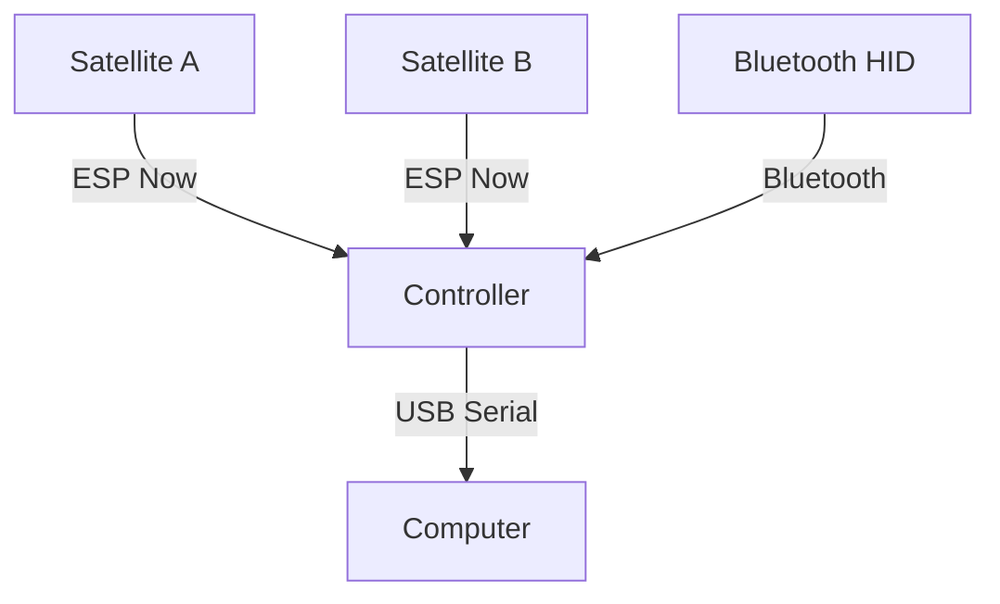

# Castanets-ESP32

## Description

It's an example project for an upcoming Presentation about MicroControllers in
Video Games (2026/09/12) for Cadiz GameDev.

Which tries to make a Rhythm Game/Controllers based on Castanets; this project is the game controller side of things.

It's a ESP32-based controller/satellite system composed of two independent ESP-IDF applications:  

- **controller/** — Main controller device (CentralHub) responsible for communication with satellite devices, USB/PC communication (Game Engine Support) and Bluetooth input (Nintendo's Joycon IR support).  
- **satellite/** — Remote satellite device responsible for local piezo/GPIO (Optional IMU) control and monitoring and communication with the CentralHub/Controller.

The project uses ESP-IDF, CMake, and Nix Flakes for development and build environment management.

## Devices Supported

- Controller:
  - ESP32-S3 - XTensa Based - ESP32-S3-DevKitC-1-N8R8
- Satellites:  
  
  | MicroController | MCU Architecure | Model | IMU Support | Notes |
  |---- |----| ---- | --- | --- |
  | ESP32-S3 |  XTensa | Waveshare ESP32-S3 1.85inch Touch | ✅ | Proof of Concept |
  | ESP32-C3 | RISC V | Seeed XIAO ESP32-C3 Miniboard | ❌ | |
  | ESP32-C6 | RISC V | Seeed XIAO ESP32-C6 Miniboard | ❌ | |
